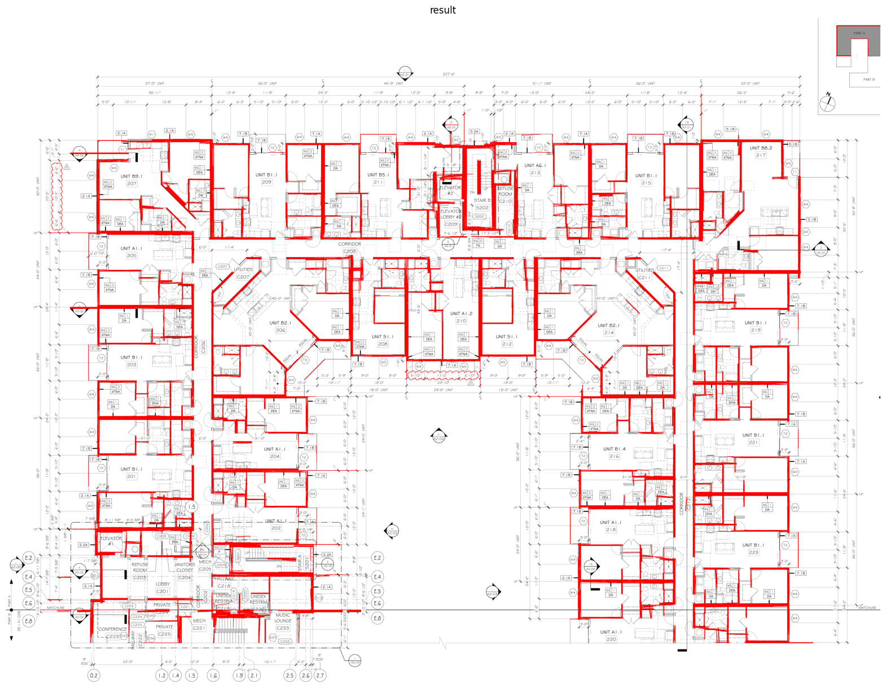

# Wall Detection API

Detects walls in architectural blueprint PDFs using classical computer vision techniques. Uploads a PDF floor plan and returns a PNG image with detected walls highlighted in red.

> **Note:** I'm aware that training segmentation or object detection models (e.g., using the CubiCasa dataset) would likely yield better results for this task. I saw other approaches going that route, but I wanted to try something different and explore how far classical computer vision techniques could go.

## How It Works

The pipeline processes a PDF blueprint through these stages:

1. **PDF to Image** — Converts the first page of the PDF to a high-resolution image (300 DPI).
2. **Preprocessing** — Removes borders, resizes, and applies adaptive binarization.
3. **Wall Extraction** — Uses morphological operations to isolate horizontal, vertical, and diagonal wall structures.
4. **Edge Detection & Line Fitting** — Applies Canny edge detection followed by Hough Line Transform to detect wall segments.
5. **Filtering** — Filters lines by length and angle to keep only valid wall candidates.
6. **Output** — Draws detected walls (red lines) over the original image.

## Running with Docker

### Prerequisites

- [Docker](https://www.docker.com/get-started) installed and running

### Start the API

```bash
docker compose up --build
```

The API will be available at `http://localhost:8000`.

### Endpoints


| Method | Path            | Description                          |
| ------ | --------------- | ------------------------------------ |
| GET    | `/health`       | Health check                         |
| POST   | `/detect-walls` | Upload a PDF and get wall detections |

### Example Usage

```bash
curl -X POST -F "file=@your-floor-plan.pdf" http://localhost:8000/detect-walls --output result.png
```

This sends a PDF floor plan and saves the output image with detected walls to `result.png`.

### Stop the API

```bash
docker compose down
```

## Output

<!-- Add your output image below -->



## Tech Stack

- **FastAPI** — Web framework
- **OpenCV** — Image processing and computer vision
- **pdf2image** — PDF to image conversion
- **NumPy** — Numerical operations
